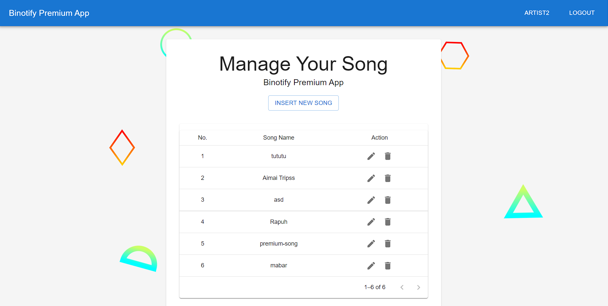
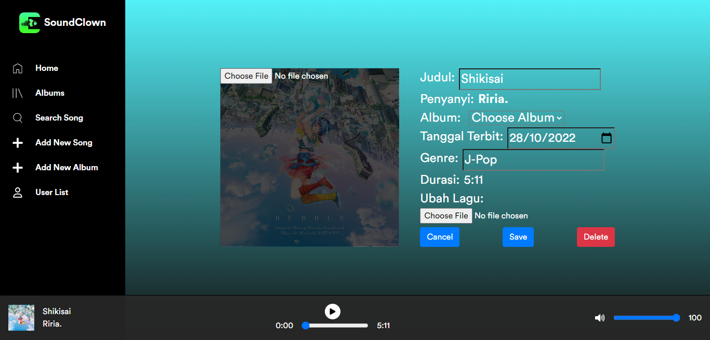

# Dockerized Microservices Application
> A microservices app for listening and managing music access with multiple languages and databases

## High Level Description

## Detailed Specification and Documentations
You can find the details of app specification and the documentation for each of the app here
- [App Specification (Indonesian Language)](assets/Spesifikasi%20Tugas%20Besar%20II%20IF3110%202022_2023%20(1).pdf)
- [React App Documentation](binotify-premium-app-v3/binotify-premium-app-v3/README.md)
- [PHP App Documentation](binotify-app-php-v2/binotify-app-php-v2/README.md)
- [REST Service Documentation](binotify-rest-service-v2/binotify-rest-service-v2/README.md)
- [SOAP Service Documentation](service-soap-v1/service-soap-v1/README.md)

## Several Sequence Diagrams
1. Create Subscription Sequence Diagram

2. Subscription Approval Sequence Diagram

3. Fetch Premium Songs Sequence Diagram

## Sneak Peaks
### React App
1. Login Page

2. Register Page

3. Subscription Request Page

4. Acccept Subscription Request Modal

5. Manage Song Page

6. Song Creation Page

7. Song Edit Page

### PHP App

1. Home Page

2. Album List Page

3. Search, Sort and Filter View

4. Song Detail Page

5. Add Song Page

6. Song Edit Page

7. Album Detail Page

8. Insert Album Page

9. User List Page

10. Premium Artists Page

11. Premium Songs Page

12. Login Page

13. Register Page

