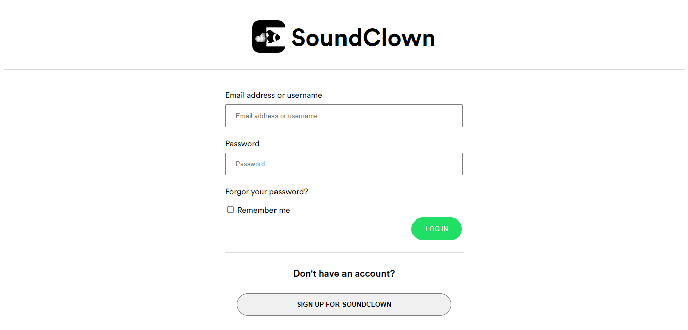
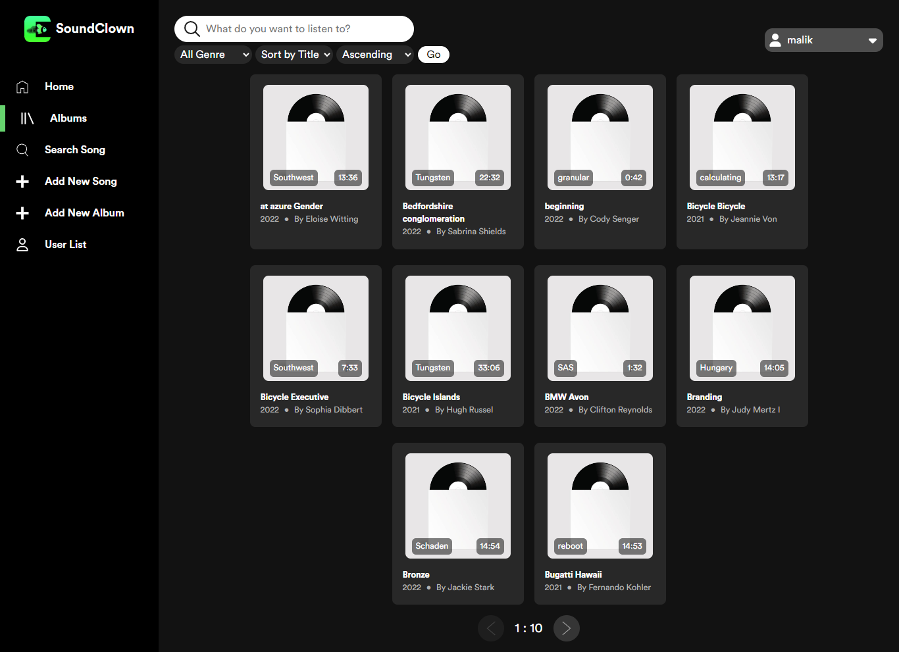
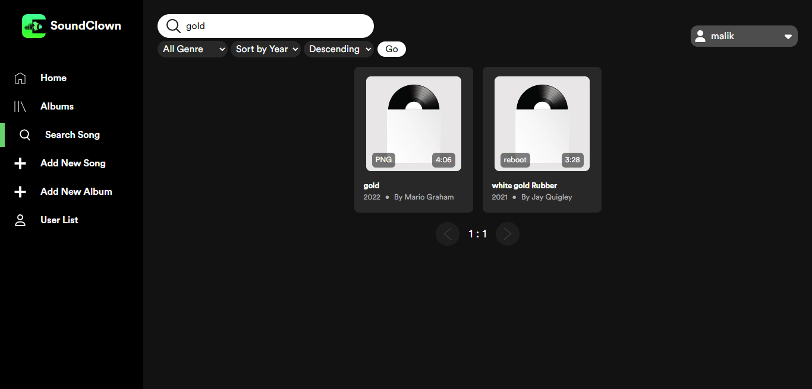
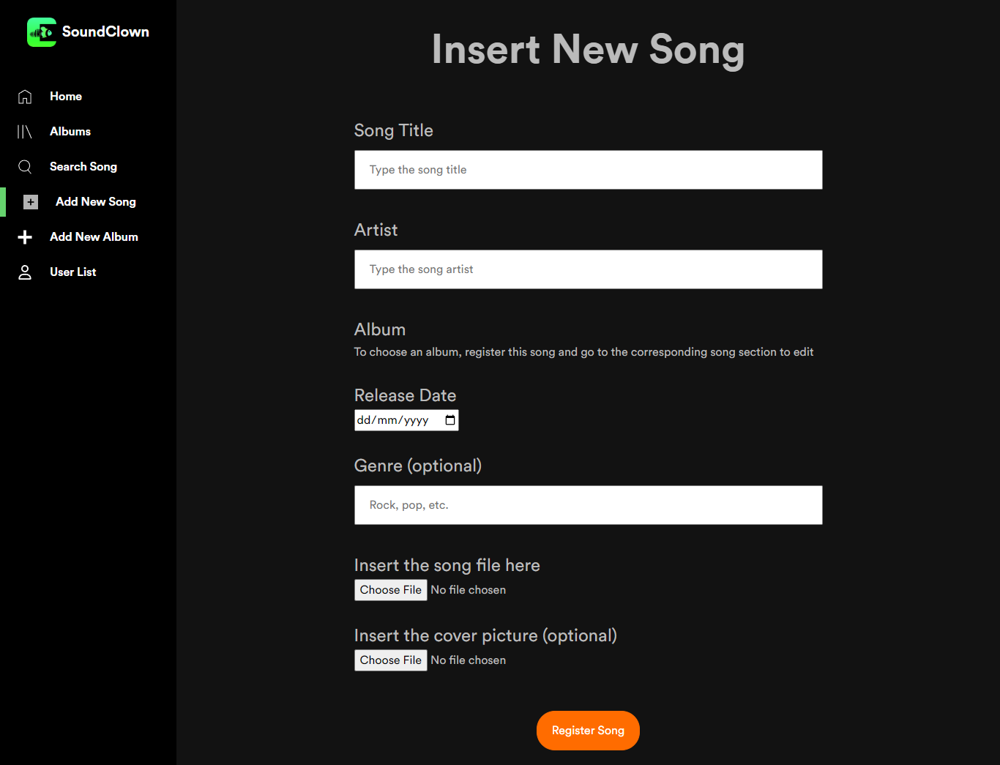
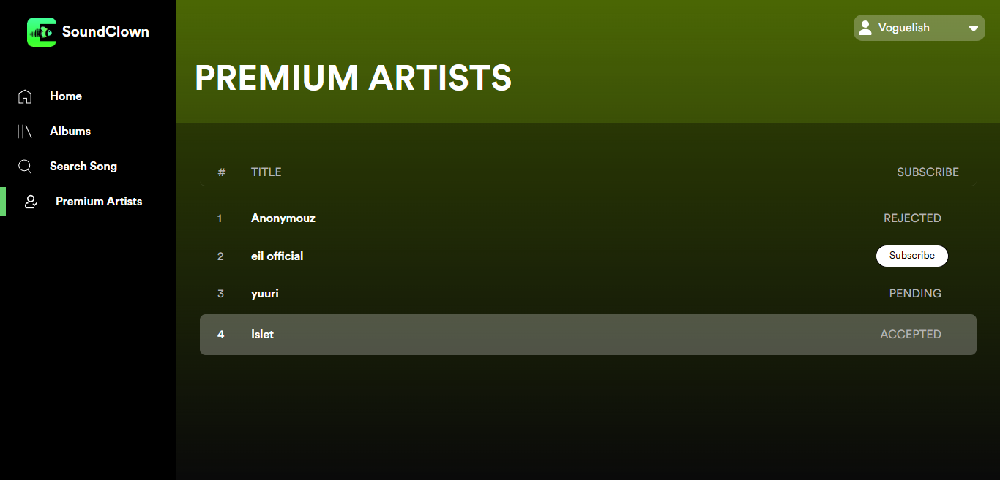

# SoundClown Binotify App PHP
### Tugas Besar 2 IF3110
### Milestone 2 -  Web Services using SOAP and REST
### Kelompok 16: IF3110-2022-k01-02-16

### Deskripsi Aplikasi Web

Aplikasi SoundClown merupakan aplikasi musik berbasis web. Aplikasi ini memiliki fungsi untuk memutar lagu, searching lagu, dan login register baik untuk pengguna maupun admin. Selain itu, admin juga dapat melakukan modifikasi untuk album dan lagu. Secara desain, aplikasi sengaja dibuat mirip dengan Spotify. Aplikasi ini juga memiliki fitur lagu premium dan subscription.

### Daftar Requirement
Berikut merupakan daftar requirements untuk aplikasi:
1. HTML
2. CSS
3. JavaScript
4. SQL
5. PHP
6. Docker (opsional)

### Cara Instalasi

Terdapat 2 cara untuk melakukan instalasi untuk aplikasi SoundClown, yaitu menggunakan XAMPP atau Docker.

#### XAMPP
1. Unduh XAMPP dari situs Apache Friends jika belum ada, disarankan versi 8.0.x.
2. Lakukan instalasi XAMPP.
4. Mulai server MySQL dari XAMPP.
3. Lakukan Clone pada repository ini.
5. Pada folder migrations, terdapat binotify.sql. Jalankan file sql tersebut terhadap database yang ingin digunakan. Contoh:
`mysql -u username nama_database < binotify.sql`
6. Buat file bernama `.env`, copy isi file `.env.example` ke `.env`. Sesuaikan isinya dengan spesifikasi database yang sudah ada.
7. SoundClown siap dijalankan.

#### Docker
1. Pastikan docker sudah ter-install.
3. Ubah file isi `inc/bootstrap.php` pada `.env` menjadi `.env.docker`.
2. Jalankan perintah `docker compose up` pada terminal.
4. SoundClown siap dijalankan.

### Cara Menjalankan Server
Sama seperti instalasi, tahap ini dibagi menjadi dua, yaitu menggunakan XAMPP atau Docker.

#### XAMPP
1. Pastikan server MySQL XAMPP dengan database binotify sudah berjalan.
2. Pada direktori ini, jalankan perintah `php -S localhost:port`. Port diganti dengan angka, umumnya 3000.
3. Buka browser dan masukkan alamat http://localhost:port/.
4. SoundClown berhasil dijalankan.

#### Docker
1. Setelah menjalankan perintah `docker compose up`, buka terminal lain.
2. Jalankan perintah `php -S localhost:port`. Port diganti dengan angka, umumnya 3000.
3. Buka browser dan masukkan alamat http://localhost:port/.
4. SoundClown berhasil dijalankan.

### Screenshot Tampilan Aplikasi Per Halaman
Berikut merupakan screenshot tampilan aplikasi untuk setiap halaman:
1. Halaman Login

2. Halaman Register

3. Home

4. Daftar Album

5. Search, Sort and Filter

6. Halaman Detail Lagu

7. Tambah Lagu

8. Edit Lagu

9. Halaman Detail Album

10. Halaman Insert Album

11. Halaman User List

12. Halaman Premium Artists

13. Halaman Premium Songs dari Penyanyi

### Pembagian Tugas
- PHP App
    - Perubahan Database: 13520105
    - FE + BE Binotify Halaman List Penyanyi Premium: 13520127, 13520153
    - FE + BE Binotify Halaman List Lagu Premium: 13520127, 13520153
    - Endpoint Callback: 13520105
    - HTTP Client ke REST: 13520105
    - Client for other services: 13520105

### Anggota Kelompok 16:
- 13520105 Malik Akbar Hashemi Rafsanjani
- 13520127 Adzka Ahmadetya Zaidan
- 13520153 Vito Ghifari