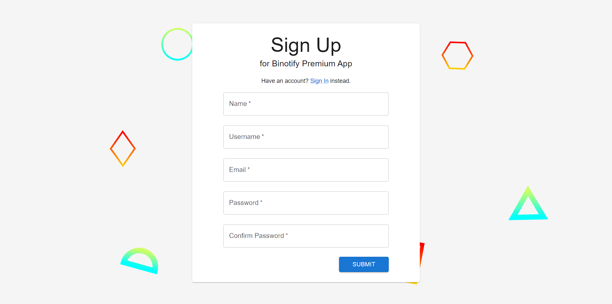

# Binotify Premium App
## Deskripsi singkat
Binotify Premium App adalah aplikasi web front-end untuk melakukan manajemen lagu pada penyanyi premium serta pendaftaran penyayi premium. Selain itu, aplikasi ini dapat digunakan untuk melakukan penerimaan atau penolakan pada request untuk subscription pada penyanyi yang bersangkutan.

## Cara install & run

### Install
1. `git clone https://gitlab.informatika.org/if3110-2022-k01-02-16/binotify-premium-app.git`
2. `cd binotify-premium-app`
3. `npm install`

### Run
1. `npm run dev`

## Screenshot Aplikasi
1. Halaman Login

2. Halaman Register

3. Halaman Subscription Request

4. Acccept Subscription Request

5. Halaman Manage Song

6. Halaman Membuat Lagu

7. Halaman Mengedit Lagu

## Pembagian Tugas

- Frontend Binotify Premium Halaman Login : 13520153
- Frontend Binotify Premium Halaman Register : 13520153, 13520105
- Frontend Binotify Premium Halaman Manage Song : 13520153, 13520127
- Frontend Binotify Premium Halaman Create Song : 13520153, 13520105
- Frontend Binotify Premium Halaman Edit Song : 13520153, 13520105
- Frontend Binotify Premium Halaman Subscription Request : 135320153, 13520127
- Client for other services: 13520105
