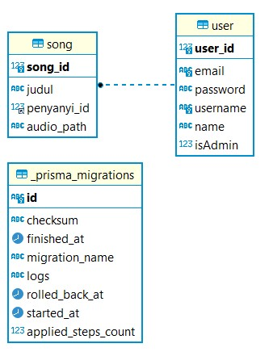
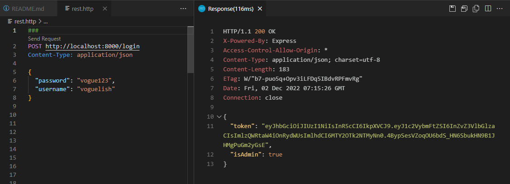
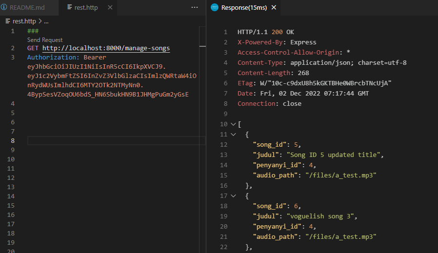
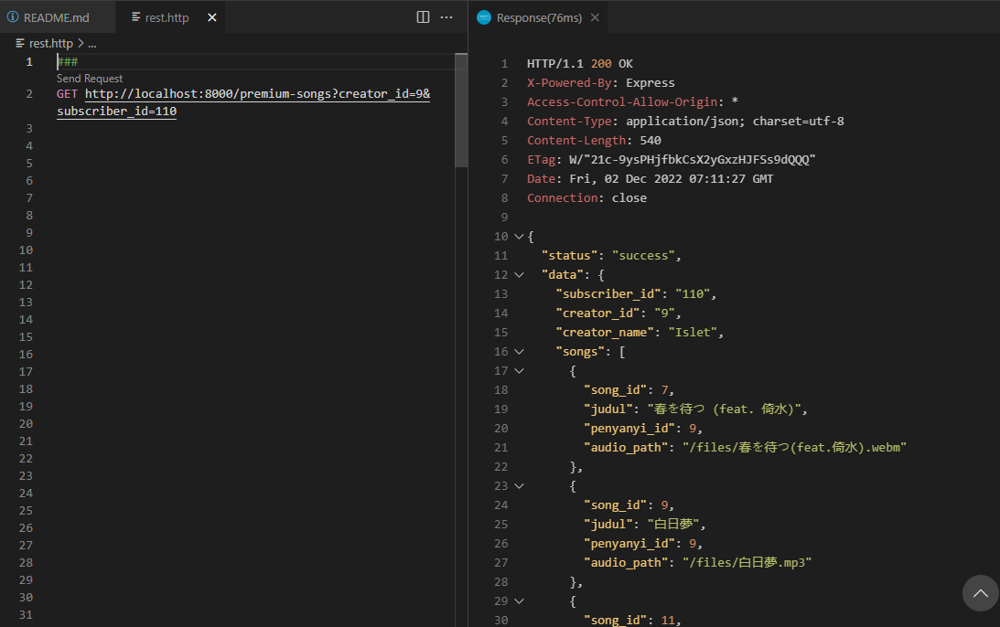
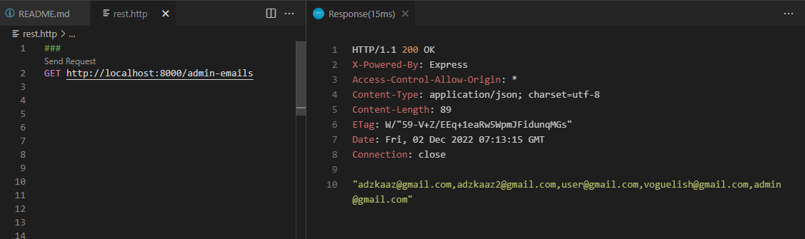

# SoundClown Binotify REST Service
### Tugas Besar 2 IF3110
### Milestone 2 -  Web Services using SOAP and REST
### Kelompok 16: IF3110-2022-k01-02-16

### Deskripsi REST Service
REST service ini menangani pengelolaan lagu premium oleh seorang penyanyi. Service ini dibuat menggunakan bahasa NodeTS dan clientnya menggunakan ReactTS. Service ini digunakan oleh admin Binotify Premium serta Artist Premium untuk mengelola lagu premiumnya. Service ini dapat melakukan autentikasi pengguna dan menerima pemanggilan untuk mendapatkan email admin.

### Skema Basis Data

### Daftar Requirement
Berikut merupakan daftar requirements untuk aplikasi:
1. npm
2. typescript
3. prisma
4. SQL
5. jwt
6. node express

### Cara Instalasi
1. Unduh requirements yang belum tersedia
2. Lakukan instalasi requirements
3. Lakukan Clone pada repository ini
2. Pada direktori ini, jalankan perintah `npm install`
5. Pada folder migrations, terdapat migration.sql. Jalankan file sql tersebut terhadap database yang ingin digunakan. Contoh:
`mysql -u username nama_database < migration.sql`
6. Buat file bernama `.env`, copy isi file `.env.example` ke `.env`. Sesuaikan isinya dengan spesifikasi database yang sudah ada
7. REST Service siap dijalankan

### Cara Menjalankan Server
1. Pastikan server MySQL XAMPP dengan database yang sesuai sudah berjalan
2. Pada direktori ini, jalankan perintah `npm run dev`
3. REST Service berhasil dijalankan

### Screenshot REST Service
1. Authentication

2. Premium Songs as the Artist

3. Premium Songs by Subscription

4. Admin Emails

### Pembagian Tugas
- REST
    - Database: 13520127
    - Autentikasi Pengguna: 13520127
    - Pengelolaan Lagu Premium: 13520127
    - Endpoint List Penyanyi: 13520127
    - Endpoint List Lagu dari Penyanyi: 13520105
    - Endpoint List Email Admin: 13520127
    - Caching: 13520105
    - Client for other services: 13520105
    - Endpoint get songs by id: 13520153

### Anggota Kelompok 16:
- 13520105 Malik Akbar Hashemi Rafsanjani
- 13520127 Adzka Ahmadetya Zaidan
- 13520153 Vito Ghifari