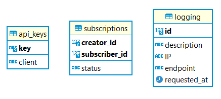

# Binotify App Service SOAP

## Deskripsi Web Service

Service SOAP pada Binotify App digunakan untuk mengelola permintaan subscription dari Binotify untuk artist premium untuk lagu-lagu premium. Service ini juga digunakan untuk logging pada request-request tersebut.

## Skema Basis Data

**api_keys**

1. key: string
2. client: string

**subscriptions**

1. creator_id: int
2. subscriber_id: int
3. status: 'PENDING' | 'ACCEPTED' | 'REJECTED'

**logging**

1. id: int
2. description: string
3. ip: string
4. endpoint: string
5. requested_at: datetime

## How to run

- clone this repository
- make sure you use jdk 8 (1.8)
- configure project structure to include lib jar
- create database and run migration file
- run project

## Pembagian Tugas

- Subscription List: 13520105, 13520153
- Accept Subscription: 13520105
- Reject Subscription: 13520105
- Request Subscribe: 13520105
- Check Subscription Status: 13520105
- Get Subscription By Status: 13520105
- Logging: 13520127
